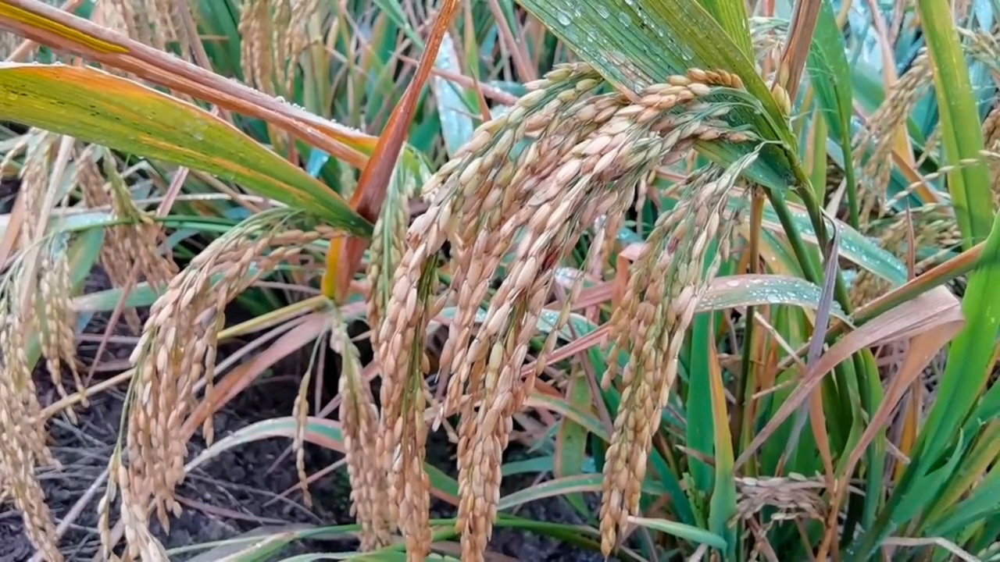

# Time Series Analysis for Rice Price in Central Java 2017-2023

## About

Time series analysis can be used to predict a quantity or a value in to the future, and also to explain any historical patterns from a time series data. For example, we can observe the seasonal patterns of a commodity's price and predict how it looks in the future.

One kind of statistical model that can be used to analyze and predict time series data is ARIMA (AutoRegressive Integrated Moving Average), which I am going to use in this notebook to analyze the price trend of rice in Central Java from 2017 to 2023, and also to predict how the trend behaves later on.

## Usage

Users can clone this project by running the following code:

    git clone git@github.com:garudapaksi-yusuf/TSA_Rice_Price.git

Users can also view the Jupyter Notebook directly in notebook/TSA_Rice_Price.ipynb

## Project Organization

The directory structure of Time Series Analysis for Rice Price project is shown below:

    ├── README.md          <- Top-level README for developers using this project.
    │
    ├── data               <- Time Series Analysis for Rice Price database.
    │
    ├── docs               <- Images, references, and other documentation for this project.
    │
    ├── notebook           <- Jupyter Notebook of this project.
    │
    └── requirements.txt   <- Module requirements for reproducing the project environment;
                              manually generated with session_info